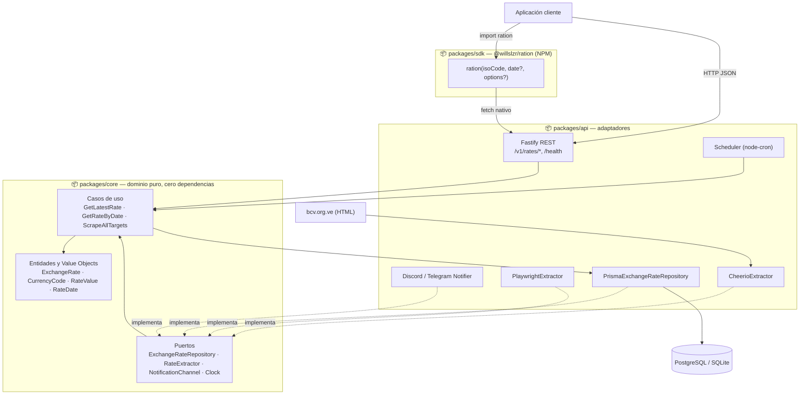
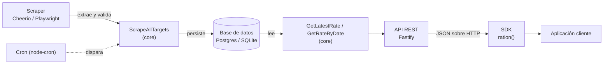

# Ratio

[](https://github.com/Willslzr/Ration-rate/actions/workflows/ci.yml)

Backend que extrae tasas de cambio (monedas sudamericanas y EUR frente a USD, con foco en el BCV oficial y el paralelo de Venezuela), las persiste como histórico inmutable y las expone vía una API REST y un SDK de NPM (`@willslzr/ration`).

Monorepo pnpm con arquitectura hexagonal: el dominio (`core`) no depende de nada; los adaptadores (`api`) y el cliente (`sdk`) dependen de `core`, nunca al revés.

**Stack**: TypeScript estricto · Fastify 5 · Prisma 7 (driver adapters, Postgres/SQLite) · Cheerio/Playwright · Vitest · Docker · GitHub Actions.

## Arquitectura



Flujo de datos, de la fuente al consumidor final:



**Regla de dependencias**: `api` y `sdk` pueden importar de `core`; `core` no importa nada de `api` ni de `sdk` (verificado: `packages/core/package.json` no tiene dependencias). Los puertos (interfaces) viven en `core`; cada adaptador concreto —Prisma, Cheerio, Playwright, Fastify, los notificadores de Discord/Telegram— implementa uno de esos puertos y vive en `api`.

## Estructura del monorepo

```
ratio/
├── packages/
│   ├── core/   # Dominio puro: entidades, value objects, puertos y casos de uso
│   ├── api/    # Adaptadores: persistencia, scraping, notificaciones, servidor HTTP y cron
│   └── sdk/    # Paquete NPM publicable "@willslzr/ration"
├── .github/workflows/ci.yml   # lint + typecheck + build + test (coverage) en cada push/PR
├── Dockerfile                 # build multi-stage, runner sin dependencias de dev
└── docker-compose.yml         # api + postgres:16, listo para `docker compose up`
```

## Quickstart local (pnpm)

Requisitos: Node ≥ 20 (`.nvmrc` fija `20`), pnpm vía Corepack.

```bash
corepack enable                 # si pnpm no está activado todavía
pnpm install                    # instala todo el monorepo + genera el cliente Prisma (SQLite)

# packages/api/.env — mínimo necesario para levantar el servidor localmente
cat > packages/api/.env <<'EOF'
DATABASE_URL="file:./dev.db"
API_KEYS="dev-local-key"
EOF

pnpm --filter @ratio/api run db:migrate:deploy   # aplica las migraciones a dev.db (SQLite)
pnpm build                                       # compila core → api → sdk (orden importa: ver nota abajo)
pnpm --filter @ratio/api run start               # arranca Fastify + el scheduler de cron

curl http://localhost:3000/health
# => {"status":"ok","database":"ok"}
```

> **Nota**: `pnpm typecheck` corre `build` primero — cuando `api` importa tipos de `@ratio/core`, TypeScript los resuelve vía el `dist/` de `core`, no desde su código fuente. En un checkout limpio, saltarse el build antes de typechequear rompe la compilación.

No hay datos sembrados: sin correr el scraper (`pnpm --filter @ratio/api run scrape`) contra un target real o insertar filas manualmente, `/v1/rates/*` devolverá `404 RATE_NOT_FOUND` hasta la primera corrida exitosa del cron (por defecto, cada hora — `CRON_EXPRESSION`).

## Quickstart con Docker

```bash
cp .env.example .env   # opcional: todas las variables tienen default en docker-compose.yml
docker compose up -d --build
curl http://localhost:3000/health
# => {"status":"ok","database":"ok"}
```

`docker compose up` levanta dos servicios:

- **postgres** (`postgres:16`): datos persistidos en el volumen nombrado `postgres-data`, con `pg_isready` como healthcheck.
- **api**: construida desde el `Dockerfile` de la raíz. Arranca solo cuando `postgres` está `healthy` (`depends_on: condition: service_healthy`), corre las migraciones y expone el puerto `3000`.

### Flujo de migración

El contenedor de la API corre `prisma migrate deploy` en cada arranque, **antes** de levantar el servidor (ver `docker-entrypoint.sh`). Es idempotente: las migraciones ya aplicadas se saltan, así que reiniciar el contenedor (o escalarlo) no reintenta nada innecesario. No hay un paso de migración manual — es parte del ciclo de vida del contenedor.

### Dos schemas de Prisma, un mismo modelo

Las migraciones de Prisma (y el motor de consultas del cliente generado) son específicas por proveedor, así que un solo `schema.prisma` no puede servir tanto a SQLite como a PostgreSQL a la vez:

|             | SQLite (dev/tests)                  | PostgreSQL (Docker/producción)                 |
| ----------- | ----------------------------------- | ---------------------------------------------- |
| Schema      | `packages/api/prisma/schema.prisma` | `packages/api/prisma/postgresql/schema.prisma` |
| Migraciones | `packages/api/prisma/migrations/`   | `packages/api/prisma/postgresql/migrations/`   |
| Config      | `packages/api/prisma.config.ts`     | `packages/api/prisma.postgresql.config.ts`     |

Ambos schemas definen el mismo modelo `ExchangeRate`; solo cambia `provider` y el historial de migraciones. `createPrismaClient()` elige el driver adapter correcto (`@prisma/adapter-better-sqlite3` o `@prisma/adapter-pg`) según el esquema de `DATABASE_URL` — pero el **cliente generado** debe corresponder al mismo proveedor (por eso la imagen de Docker corre `prisma generate --config=prisma.postgresql.config.ts` en su etapa de build). Esto se verificó de punta a punta contra un Postgres real antes de escribir el Dockerfile.

### Por qué la imagen no incluye Chromium

El `Dockerfile` **no** instala las dependencias del sistema que necesita Playwright/Chromium. El único target de tipo `'spa'` en `targets.config.ts` está `active: false`; el target real (`bcv_oficial`) es `'html'` (Cheerio, sin navegador). Instalar Chromium agregaría ~300+ MB para una ruta de código que nunca se ejecuta hoy. Si se activa un target `'spa'` real, el propio `Dockerfile` documenta el comando a agregar:

```dockerfile
RUN pnpm --filter @ratio/api exec playwright install --with-deps chromium
```

## Endpoints

Base URL local: `http://localhost:3000`. Las rutas `/v1/rates/*` requieren el header `x-api-key`; `/health` no.

| Método | Ruta                        | Auth | Descripción                                                                                   |
| ------ | --------------------------- | :--: | --------------------------------------------------------------------------------------------- |
| GET    | `/health`                   |  No  | Estado del servicio y conectividad a la base de datos.                                        |
| GET    | `/v1/rates/:isoCode/latest` |  Sí  | Última tasa registrada para una moneda. Query opcional: `source`.                             |
| GET    | `/v1/rates/:isoCode`        |  Sí  | Tasa vigente en una fecha dada. Query: `date` (requerido, `YYYY-MM-DD`), `source` (opcional). |

```bash
# Salud del servicio
curl http://localhost:3000/health
# => {"status":"ok","database":"ok"}

# Última tasa oficial de VES
curl -H "x-api-key: dev-local-key" http://localhost:3000/v1/rates/VES/latest
# => {"isoCode":"VES","rate":"36.5842","source":"bcv_oficial","extractedAt":"2026-08-02T10:00:00.000Z"}

# Filtrando por fuente (bcv_oficial vs. paralelo)
curl -H "x-api-key: dev-local-key" "http://localhost:3000/v1/rates/VES/latest?source=bcv_oficial"

# Tasa en una fecha específica
curl -H "x-api-key: dev-local-key" "http://localhost:3000/v1/rates/VES?date=2026-04-14"

# Sin api key -> 401
curl -i http://localhost:3000/v1/rates/VES/latest
```

Todos los errores (400/401/404/429/500) responden con [RFC 9457 Problem Details](https://www.rfc-editor.org/rfc/rfc9457):

```json
{
  "type": "about:blank",
  "title": "Not Found",
  "status": 404,
  "detail": "No exchange rate found for \"ARS\".",
  "correlationId": "b3f1...-uuid",
  "code": "RATE_NOT_FOUND"
}
```

El límite de rate (`RATE_LIMIT_MAX`, 100 req/min por defecto) se aplica por `x-api-key` (o por IP en rutas sin auth); al excederlo responde `429` con header `Retry-After`.

## SDK (`@willslzr/ration`)

Cliente ligero, cero dependencias de runtime (solo `fetch` nativo), build dual ESM/CJS.

```bash
npm install @willslzr/ration
```

```typescript
import ration from "@willslzr/ration";

// Tasa más reciente
const latest = await ration("VES", undefined, {
  baseUrl: "http://localhost:3000",
  apiKey: "dev-local-key",
});
console.log(latest);
// { isoCode: 'VES', rate: '36.5842', source: 'bcv_oficial', extractedAt: 2026-08-02T10:00:00.000Z }

// Tasa histórica (acepta 'DD/MM/YYYY', 'YYYY-MM-DD' o Date)
const historic = await ration("VES", "14/04/2026", {
  baseUrl: "http://localhost:3000",
  apiKey: "dev-local-key",
});
```

`baseUrl` y `apiKey` también pueden venir de `RATION_BASE_URL` / `RATION_API_KEY` (variables de entorno), así que en un proyecto con `.env` cargado alcanza con `await ration("VES")`. Detalle completo de opciones, tipos de retorno y jerarquía de errores (`RationError`, `RationApiError`, `RationTimeoutError`, `RationNetworkError`) en [`packages/sdk/README.md`](packages/sdk/README.md).

## Variables de entorno

| Variable              | Requerida | Default        | Descripción                                                             |
| --------------------- | :-------: | -------------- | ----------------------------------------------------------------------- |
| `DATABASE_URL`        |    Sí     | —              | `file:./dev.db` (SQLite) o `postgresql://...` (Postgres).               |
| `API_KEYS`            |    Sí     | —              | Lista separada por comas de claves válidas para `x-api-key`.            |
| `NODE_ENV`            |    No     | `development`  | `development` \| `test` \| `production`. Ajusta el nivel de log.        |
| `PORT`                |    No     | `3000`         | Puerto HTTP.                                                            |
| `RATE_LIMIT_MAX`      |    No     | `100`          | Requests por minuto por `x-api-key`/IP antes de responder `429`.        |
| `CRON_EXPRESSION`     |    No     | `0 * * * *`    | Frecuencia del scraper (formato cron estándar).                         |
| `DISCORD_WEBHOOK_URL` |    No     | _(sin efecto)_ | Si se configura, notifica fallas de scraping a un canal de Discord.     |
| `TELEGRAM_BOT_TOKEN`  |    No     | _(sin efecto)_ | Junto con `TELEGRAM_CHAT_ID`, notifica fallas de scraping vía Telegram. |
| `TELEGRAM_CHAT_ID`    |    No     | _(sin efecto)_ | Ver `TELEGRAM_BOT_TOKEN`.                                               |

Sin ningún canal de notificación configurado, las fallas de scraping solo se registran en el log (`NoopNotifier`) — nunca detienen el resto de la corrida.

## Testing y CI

```bash
pnpm lint        # eslint .
pnpm typecheck   # build + tsc --noEmit por paquete
pnpm build       # tsc/tsup por paquete
pnpm test        # vitest run (proyectos por workspace)
pnpm test:coverage
```

- Tests de scraping contra **fixtures HTML locales** — nunca contra la red real.
- Tests de integración de Prisma y tests end-to-end de API/SDK contra **SQLite temporal** (creada y destruida por test, vía `mkdtemp`), levantando el servidor real (`buildServer` + repositorio real) — no hay mocks del framework HTTP ni de la base de datos en esos casos.
- Cobertura de `core` (el dominio) con un **umbral del 80%** (`vitest.config.ts`) — CI falla si baja.
- GitHub Actions (`.github/workflows/ci.yml`) corre lint → typecheck → build → test con cobertura en cada push a `main` y en cada PR, y sube el reporte de cobertura como artifact.

## Decisiones de arquitectura

### ¿Por qué hexagonal?

El dominio (`core`) no sabe que existen Fastify, Prisma, Cheerio o Playwright — solo conoce sus propios puertos (`ExchangeRateRepository`, `RateExtractor`, `NotificationChannel`, `Clock`). Esto compra tres cosas concretas, no solo "buenas prácticas" abstractas:

1. **Los casos de uso se testean sin infraestructura real.** `GetLatestRate`, `GetRateByDate` y `ScrapeAllTargets` se prueban con fakes escritos a mano (sin base de datos, sin red, sin navegador), así que su suite corre en milisegundos y no es flaky por un contenedor lento.
2. **Los adaptadores son intercambiables sin tocar el dominio.** El proyecto ya lo demuestra dos veces: SQLite en dev/test vs. PostgreSQL en Docker/producción (mismo `ExchangeRateRepository`, dos implementaciones), y Cheerio vs. Playwright para scraping (mismo `RateExtractor`, elegido por `ExtractorFactory` según el tipo de target). Migrar de proveedor de base de datos o cambiar de estrategia de scraping es un cambio en `api`, nunca en `core`.
3. **La regla de dependencias es verificable, no solo documentada.** `packages/core/package.json` no declara ninguna dependencia — si alguien intentara importar Prisma o Fastify desde `core`, el build fallaría (esos paquetes ni siquiera están instalados ahí). La arquitectura está forzada por tooling, no por disciplina de code review.

El costo es real: hay una interfaz extra entre cada caso de uso y su implementación, y para un CRUD simple de un solo desarrollador esa indirección puede no pagarse. Tiene sentido aquí porque el dominio (validación de tasas, ventanas de fecha, reintentos con backoff) es lo bastante no trivial como para merecer tests aislados, y porque el proyecto ya tiene dos adaptadores reales por puerto (no uno hipotético "por si acaso").

### ¿Por qué las tasas son siempre `string` decimal, nunca `number`?

`0.1 + 0.2 !== 0.3` en punto flotante IEEE 754 — inaceptable para un valor que representa dinero. `RateValue` guarda el string tal como llega (validado con una regex de decimal positivo), lo persiste como `String` en ambos schemas de Prisma (`rate String`, con comentario explícito en el schema), y solo expone `toNumber()` para display, documentado como "nunca usar en cálculos de dominio". El sistema completo nunca hace aritmética con tasas — solo las guarda, las compara para ordenar por fecha, y las devuelve tal cual. Si en el futuro hiciera falta sumar o convertir tasas, la solución sería una librería de precisión arbitraria (`decimal.js`, `big.js`) operando sobre el string — nunca `number` nativo.

### ¿Por qué monorepo?

`core`, `api` y `sdk` cambian juntos con más frecuencia de lo que cambian por separado: agregar un endpoint casi siempre toca un caso de uso en `core`, su ruta en `api`, y potencialmente el tipo de retorno del `sdk`. Un monorepo con pnpm workspaces permite que ese cambio sea **un solo commit atómico y un solo PR**, con `workspace:*` resolviendo las referencias entre paquetes al código fuente local (vía su `dist/` compilado) sin publicar nada a NPM en el camino. También comparte una única configuración de TypeScript estricto, ESLint y Vitest en los tres paquetes, así que las convenciones no divergen por repo.

La contrapartida: un monorepo no impone límites entre paquetes por sí solo — sin la regla explícita "`core` no depende de nadie" (y sin verificarla, como se explica arriba), nada impide que `core` termine importando algo de `api` con el tiempo. El límite lo pone la regla de dependencias, no la estructura de carpetas.

## Licencia

Proyecto personal de portfolio. Sin licencia de uso público declarada.
